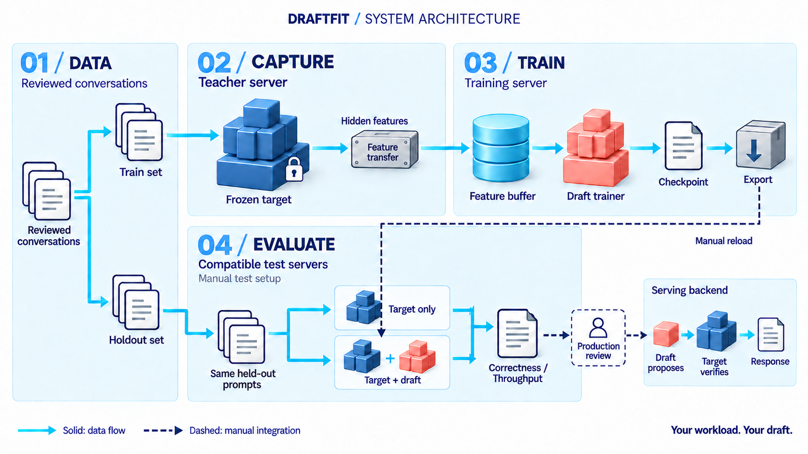

# Draftfit

**Train speculative decoding drafts for your model, your workload, your data.**

**DSpark · DFlash · DFlash2 · EAGLE3 · PEagle · Domino**

[Quick start](#quick-start) · [Draft methods](#draft-methods) · [Example models](#example-models) · [Documentation](docs/README.md)

Draftfit helps individual developers and agent builders train a smaller draft
for the tasks their LLM actually handles. Start with your conversations, choose
a target and draft method, then train, export and benchmark through one CLI.
Inference teams and researchers can use the same workflow to compare methods.

Your target stays frozen. The draft proposes tokens; the target verifies them.
**Your workload. Your draft.**

Source release **0.2.0** · [Changelog](CHANGELOG.md) · [Upcoming work](plans/README.md)

[](https://github.com/JayYun98/Draftfit/releases/download/v0.2.0/draftfit-system-demo-en.mp4)

[Watch the 29-second workflow overview](https://github.com/JayYun98/Draftfit/releases/download/v0.2.0/draftfit-system-demo-en.mp4) — an illustrated workflow, not a measured speedup demo.

## Why Draftfit?

- **Use your own data.** Prepare reviewed conversation exports with a separate holdout set.
- **Make the draft yours.** Configure the target, draft method, depth, feature layers and block size; fine-tune a compatible existing draft or train a new one.
- **Choose how to train.** Reuse offline target features or stream them to separate training workers. Recover interrupted runs and export the result.
- **Measure what matters.** Compare end-to-end throughput on your workload—not just training loss or token acceptance. Speedup is measured, not promised.

```text
Your conversations → Prepare → Capture → Train → Export → Benchmark
                              teacher    draft            vs target only
```

## Quick start

[Install the matching uv environment](docs/ENVIRONMENT.md) first. In a provisioned
runtime, prepare your reviewed conversations and a DSpark training project:

~~~sh
draftfit data prepare --input ./my-conversations.jsonl \
  --output ./data/train.jsonl --split-eval --eval-output ./data/holdout.jsonl

draftfit target prepare /path/to/target --local-only \
  --strategy dspark --train-data ./data/train.jsonl --output-dir ./my-draft

draftfit train -c ./my-draft/train.json --plan
draftfit train -c ./my-draft/train.json
~~~

This online example defaults to GPU 0 for the teacher and GPU 1 for training.
For saved-feature training, existing-draft fine-tuning, recovery and export,
follow the [complete workflow](docs/PUBLIC_WORKFLOW.md).

## Draft methods

| Method | Offline features | Online capture | Key requirement |
| --- | --- | --- | --- |
| DSpark | Yes | Yes | Auxiliary taps and final target hidden states |
| DFlash | Yes | Yes | Compatible hidden features and mask token |
| DFlash2 | Yes | Yes | Full vocabulary; convolution and selector training |
| EAGLE3 | Yes | Yes | One draft layer; vocabulary mapping for online training |
| PEagle | No | Yes | Flex attention and method-specific feature layout |
| Domino | Yes | Yes | Explicit compatible draft configuration |

Teachers can use **SGLang, Hugging Face Transformers or vLLM** with the same
PyTorch draft trainer. Availability depends on the target and pinned runtime;
native HF/vLLM services remain experimental.
[Backend requirements and method limits →](docs/PUBLIC_SUPPORT.md)

## Example models

Examples are starting configurations—not a promise that every model × method
combination works. “Real-weight” below means bounded functional checks, not
production or speedup certification.

| Target type | Current example | Available evidence |
| --- | --- | --- |
| Dense + KV | [Qwen3-8B](configs/qwen3-8b-dspark.json), [Llama3-8B](configs/llama3-8B-eagle3.json) | Config recipes; separate Qwen3-0.6B real-weight DSpark/DFlash2 train/resume/export checks |
| MoE + KV | [Qwen3-30B-A3B](configs/qwen3-30B-A3B-eagle3.json) | Config recipe; prior TP2 MoE capture used dummy weights |
| MoE / conv hybrid | [Ling-3.0-tiny](configs/ling-3.0-tiny-dspark.json) | Real-weight DSpark capture/train/export and bounded pinned serving/replay |
| Linear + KV hybrid | [Qwen3.5-4B](configs/qwen3.5-4b-dflash.json) | Config recipe; full target workflow not certified |
| Conv + KV | [LFM2.5-1.2B-Instruct](configs/lfm2.5-1.2b-instruct-dflash.json) | Real-weight load/chat smoke only; draft workflow pending |
| Recurrent | [RWKV7-1.5B](configs/target_specs/rwkv7-1.5b.json) | Metadata/state fixture only; requires a compatible backend |

See [all recipes](examples/configs/README.md), [exact validation scope](docs/MODEL_VALIDATION.md),
and [planned recent-model experiments](plans/README.md).
Add models through [target configuration and adapters](docs/TARGET_EXTENSION.md);
configuration alone cannot add an unsupported capture or serving backend.

## Documentation

| I want to… | Guide |
| --- | --- |
| Install or select a teacher backend | [Environment setup](docs/ENVIRONMENT.md) |
| Prepare data, train, fine-tune, resume and export | [Complete workflow](docs/PUBLIC_WORKFLOW.md) |
| Configure a new target or runtime | [Target extension](docs/TARGET_EXTENSION.md) · [Runtime profiles](docs/RUNTIME_PROFILES.md) |
| Compare target-only and draft-enabled inference | [Workload evaluation](docs/PERFORMANCE_GATE.md) |
| Check supported and unverified combinations | [Support matrix](docs/PUBLIC_SUPPORT.md) |
| Develop or reproduce validation | [Documentation index](docs/README.md) · [Source tools](scripts/README.md) |

Automatic trace ingestion and continual deployment are [future work](plans/README.md).
A longer accepted draft is not necessarily faster: measure end-to-end throughput
on held-out requests and verify correctness separately.

## Acknowledgments

Draftfit ships its own maintained training runtime derived from
[SpecForge](https://github.com/sgl-project/SpecForge), with attributed adaptations
and references from [TorchSpec](https://github.com/lightseekorg/TorchSpec),
[AngelSpec](https://github.com/Tencent/AngelSpec) and DSpark-related projects.
See [code ownership](docs/CODE_OWNERSHIP.md), [third-party notices](THIRDPARTY_NOTICES.md)
and [license](LICENSE).
